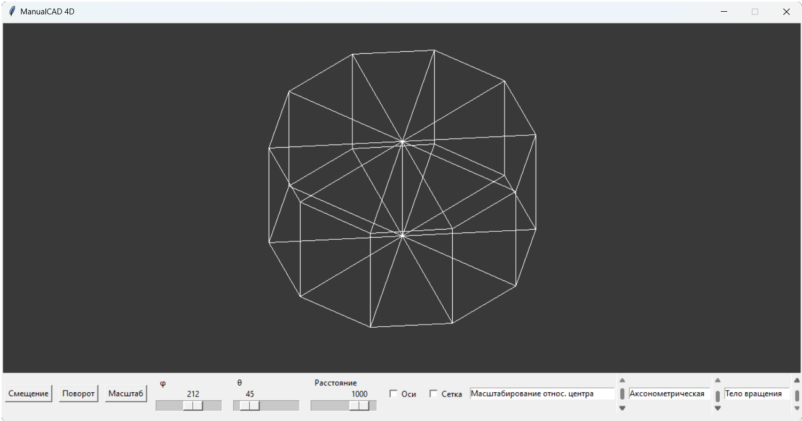
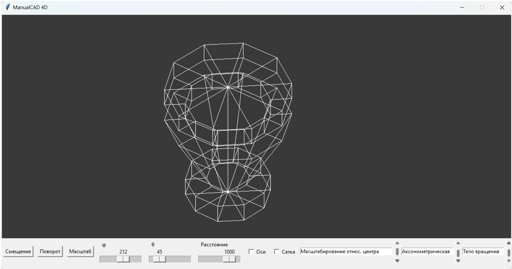
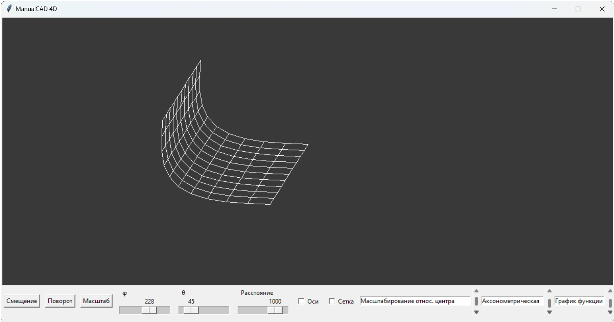

# Лабораторная работа №7. Построение трёхмерных моделей
## Задание
1. Загрузка и сохранение модели многогранника из файла
    - Формат модели должен содержать данные о гранях. Формат файла выбирается программистом.

    - Необходимо отобразить загруженную модель, позволить применять к ней аффинные преобразования.

    - Для тестов можно использовать модели многогранников из Лаб. №6.

2. Построение фигуры вращения
    - Фигура вращения задаётся тремя параметрами: образующей (набор точек), осью вращения и количеством разбиений. Угол вращений можно вычислить, поделив 360° на количество разбиений.

    - Программа должна давать возможность задать образующую и построить фигуру вращения относительно выбранной координатной оси с заданным количеством разбиений. Формат модели должен содержать данные о гранях.

    - Сохранить полученную модель в файл.*

    - Необходимо загрузить* и отобразить полученную модель, применить к ней аффинные преобразования.

3. Построение графика двух переменных
    - Сегмент поверхности задаётся функцией f(x, y) = z, диапазонами отсечения [x0, x1], [y0, y1] и количеством разбиений по осям (шагом).

    - Программа должна позволять строить сегмент поверхности, заданный выбранной функцией на заданном диапазоне с заданным количеством разбиений. Формат модели должен содержать данные о гранях. Диапазоны и разбиения можно задавать идентичными для X и Y.

    - Необходимо отобразить полученную модель, позволить применять к ней аффинные преобразования.
## Демонстрация работы

